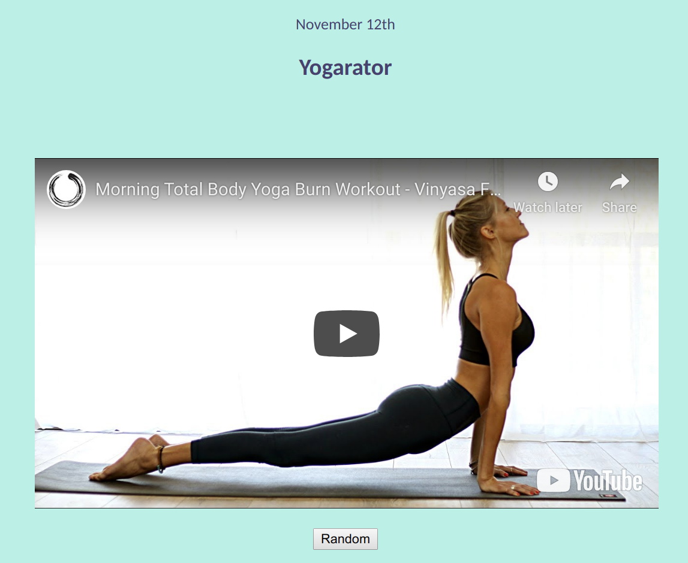

# Random Yoga Generator
Passion project to learn fullstack development. 
Inspired by Silicon Valley's tough and narrow scope
when looking for specific skills in SWE. 
This project focuses mainly on React, and frontend
 development. Most of these technologies are new to me, 
 so feel free to open a PR or message me if you see something 
that could be improved on. I am always happy to collaborate!

 

Front end:
- React
- HTML/CSS
- JavaScript/ES6

Local Backend package from Facebook used:
https://github.com/facebook/create-react-app
(Repo to easily start your React app without the
hassle of downloading Babbel, webpack, etc.)
